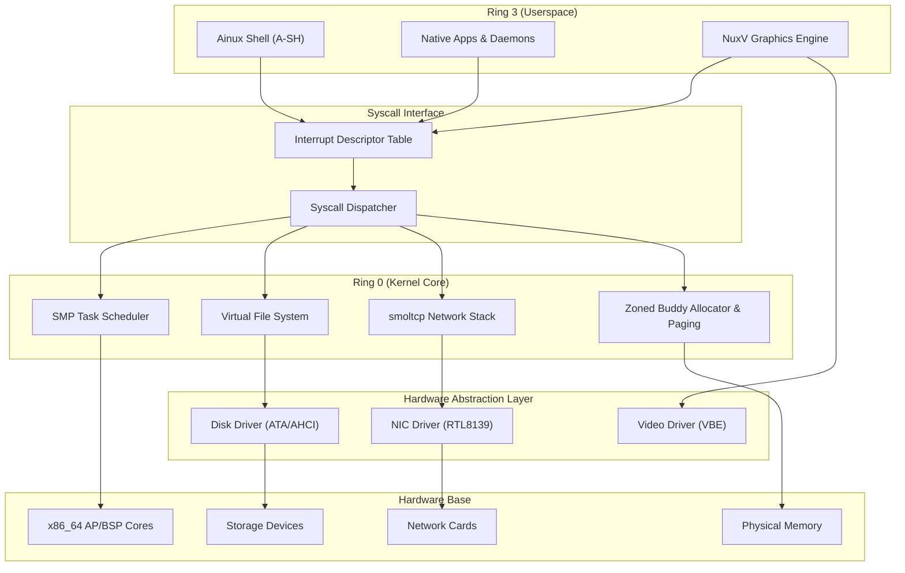
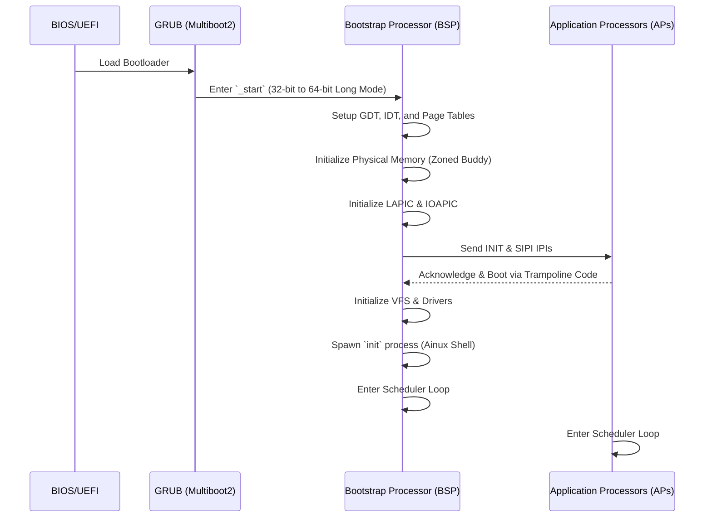
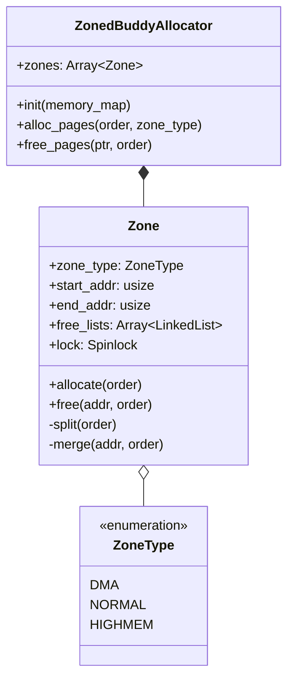
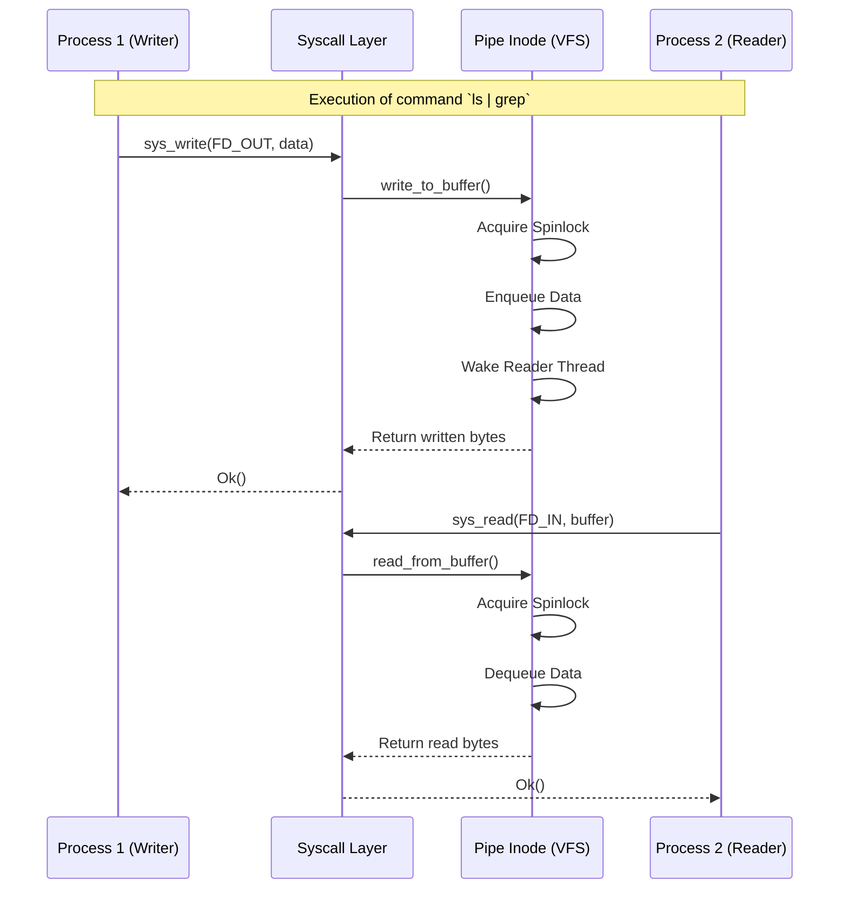

# Ainux Kernel AI Context & System Architecture

> **Notice to AI Assistants:** This document contains the sovereign architectural blueprint of the Ainux Custom Kernel. Use this file to understand the system layout, core data structures, control flows, and development guidelines.

## 1. Project Overview

Ainux is a modern, high-performance hybrid kernel built primarily in **Rust (nightly, `#![no_std]`)**, targeting the `x86_64-unknown-none` bare-metal architecture. It utilizes a modular monolithic design with support for Symmetric Multi-Processing (SMP), Virtual File Systems (VFS), a native shell (`ainux-sh`), and an integrated TCP/IPv4 networking stack via `smoltcp`.

### Core Technologies
- **Language:** Rust (2021 Edition, `#![no_std]`, `#![no_main]`), Assembly (NASM), C (for Userspace)
- **Toolchain:** `rustup target add x86_64-unknown-none`
- **Bootloader:** GRUB (Multiboot2)
- **Emulation:** QEMU with KVM

---

## 2. Directory Structure & Module Mapping

When asked to modify a feature, refer to this mapping:

- `src/main.rs`: Kernel entry point (`_start`), early initialization, architecture bootstrap.
- `src/process/`: Multitasking, SMP Scheduler (Round-Robin/Fair), task switching, threading.
- `src/mm/`: Physical Memory Management (PMM) via Zoned Buddy Allocator, Virtual Memory Management (VMM), Page Tables (ML4T).
- `src/fs/`: Virtual File System (VFS), Pipes, and concrete implementations (Ext4, Btrfs, initramfs).
- `src/net/`: Networking stack (`smoltcp`), Socket handling, dynamic port binding.
- `src/cpu/`: CPU intrinsics, GDT, IDT, Syscall dispatcher, APIC/LAPIC initialization.
- `src/drivers/`: Hardware Abstraction Layer (HAL).
  - `video`: VBE/BGA Graphics.
  - `net`: RTL8139, Atheros Ethernet.
  - `storage`: ATA PIO/DMA, AHCI.
- `src/apps/`: Native kernel-mode ring 3 binaries (`httpd`, `sshd`, `fetch`).
- `src/shell/`: `ainux-sh` interface, builtin commands (`ls`, `cd`, `cat`, `ps`, `top`).

---

## 3. UML Architectural Designs

### 3.1. Overall Kernel Architecture

### 3.2. Boot Flow & SMP Initialization

### 3.3. Memory Management: Zoned Buddy Allocator

### 3.4. VFS and Inter-Process Communication (Pipes)

---

## 4. Development Guidelines & Rules for AI Agents

When acting on this codebase, adhere to the following rules:

1. **No Standard Library**: The kernel is `#![no_std]`. Use `core::` instead of `std::`. For heap allocation, use `alloc::vec::Vec`, `alloc::string::String`, etc. (Requires `extern crate alloc`).
2. **Synchronization**: Since the kernel operates in an SMP (multicore) environment, NEVER use regular mutable static variables. Always use `spin::Mutex` or `spin::RwLock` to protect shared resources. Avoid deadlocks by minimizing lock scope.
3. **Interrupts**: When holding a spinlock in kernel space, it is often necessary to disable interrupts (`x86_64::instructions::interrupts::without_interrupts`) to prevent interrupt handlers from deadlocking the CPU.
4. **Error Handling**: Use `Result` heavily. Kernel panics should be reserved only for unrecoverable hardware or boot state failures.
5. **Memory Safety**: Limit the use of `unsafe` blocks. Only use them for direct hardware MMIO, raw pointers from FFI/Assembly, or low-level allocator manipulation. Document why `unsafe` is used.
6. **Testing**: QEMU is the primary test environment. To build and run, execute `./run.sh`.

## 5. Network Stack Integration
The network relies on `smoltcp`. Hardware packet reception is usually interrupt-driven (or polled). The `net` module abstracts the RTL8139 PCIe device and passes raw Ethernet frames to `smoltcp::iface::Interface`.

## 6. How to Extend the Kernel
- **Adding a Syscall:** 
  1. Define the syscall ID in `src/cpu/syscalls.rs`.
  2. Add the handler function matching the ID.
  3. Map the interrupt/syscall entry in ASM or IDT.
- **Adding a Command:** Add it to the `src/shell/shell.rs` command match block.

*End of AI Context Document.*
