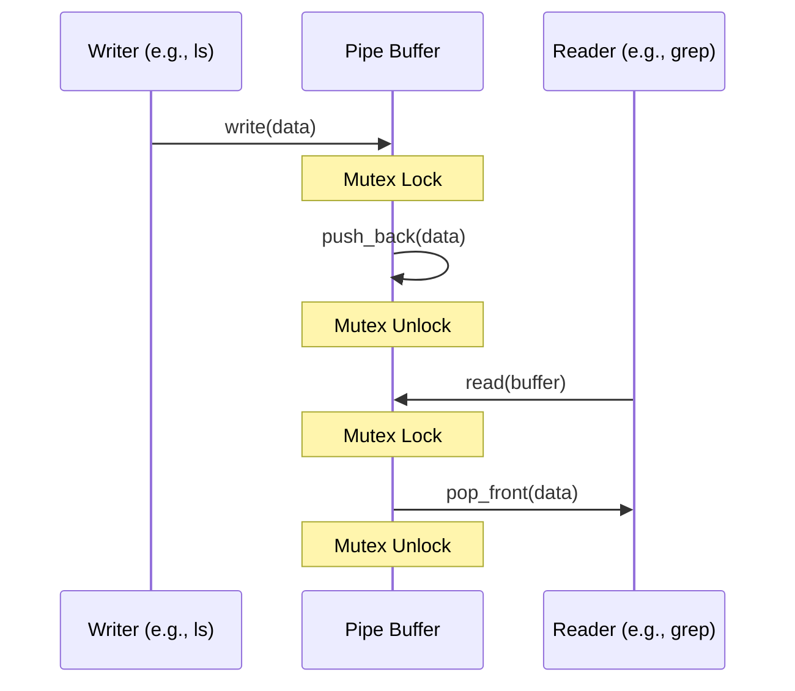

# Subsystem: Anonymous Pipes (IPC)

## 1. Structure
Located in `src/fs/pipe.rs`:
*   **`Pipe` (struct)**: Internal shared buffer (`VecDeque<u8>`) with a fixed `max_size`.
*   **`PipeReader` (struct)**: An `Arc` handle to the `Pipe` implementing `FileHandle` read logic.
*   **`PipeWriter` (struct)**: An `Arc` handle to the `Pipe` implementing `FileHandle` write logic.

## 2. Functionalities
*   **Stream Communication**: Allows unidirectional data flow between tasks.
*   **Synchronization**: Automatically blocks or fails when the buffer is empty (read) or full (write).
*   **VFS Integration**: Pipes appear as standard file handles, making them compatible with `ls`, `cat`, and `grep`.

## 3. Layers
*   **Layer 3 (Shell)**: Connects standard output of one command to standard input of another.
*   **Layer 2 (VFS)**: Manages `PipeReader` and `PipeWriter` as `ArcHandle` objects.
*   **Layer 1 (Buffer)**: The core circular buffer logic.

## 4. UML (Data Flow)

## 5. Usage
### Syscall:
*   `sys_pipe()`: Returns a pair of file descriptors (Read, Write).
### Shell Usage:
*   `ls | grep .c`: Redirects `ls` output to `grep` input via a kernel pipe.

## 6. Approaches
*   **Shared Ownership**: Uses `Arc<Pipe>` to ensure the buffer stays alive as long as either the reader or writer exists.
*   **Spinlock Protection**: Uses `spin::Mutex` for extremely low-latency access to the buffer.
*   **Non-Blocking Logic**: Currently implements a fail-on-full approach, with plans for asynchronous wait queues.
