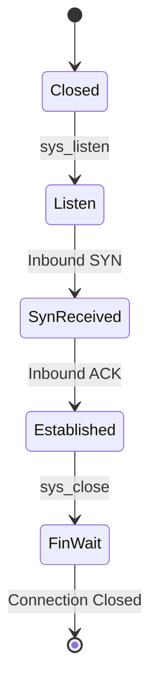

# Subsystem: Networking Stack

## 1. Structure
The stack is a composition of driver logic and protocol management in `src/net/`:
*   **`NetStack` (struct)**: High-level manager wrapping smoltcp's `Interface`.
*   **`Socket` (enum)**: Handles TCP, UDP, and Raw socket types.
*   **`SocketHandle` (type)**: An identifier used by smoltcp to track connection state.

## 2. Functionalities
*   **Packet Routing**: Inbound and outbound packet processing via the RTL8139.
*   **TCP/IP Suite**: Full support for IPv4, TCP, UDP, ARP, and ICMP.
*   **Port Multiplexing**: Allows multiple services to share a single hardware IP.

## 3. Layers
*   **Layer 4 (Application)**: `httpd`, `sshd`, `fetch`.
*   **Layer 3 (Socket API)**: Syscalls for `connect`, `listen`, `send`, `recv`.
*   **Layer 2 (smoltcp Core)**: Protocol logic and buffer management.
*   **Layer 1 (Driver)**: `rtl8139.rs` hardware interaction.

## 4. UML (Socket Lifecycle)

## 5. Usage
### Internal API:
*   `net::send(socket, data)`: Low-level data transmission.
### Shell Commands:
*   `ip addr`: Displays the current network configuration.
*   `ping <ip>`: Tests connectivity (planned).

## 6. Approaches
*   **Zero-Copy Design**: smoltcp minimizes copying by operating directly on packet buffers.
*   **Async-Ready**: Designed to be integrated with an async executor for high-concurrency hosting.
*   **Static Allocation**: Uses pre-allocated buffers to prevent heap fragmentation during heavy network load.
