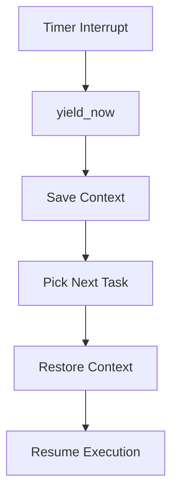

# Subsystem: Process Scheduler

## 1. Structure
The scheduler is organized into a hierarchy of data structures defined in `src/process/`:
*   **`Task` (struct)**: The fundamental unit of execution. Contains `Context` (registers), `Stack`, `State`, and `FDTable`.
*   **`Scheduler` (struct)**: Global manager. Contains a `VecDeque<Arc<Mutex<Task>>>` representing the run queue.
*   **`Context` (struct)**: Platform-specific CPU state (RAX, RBX, RIP, RSP, etc.).

## 2. Functionalities
*   **Task Switching**: Saves the context of the current task and restores the next.
*   **Preemption**: Handles timer-based interrupts to enforce time-sharing.
*   **SMP Coordination**: Manages task distribution across multiple CPU cores.
*   **System Call Dispatch**: Provides the gateway for userspace tasks to request kernel services.

## 3. Layers
*   **Layer 4 (Shell/Apps)**: Requests execution via `spawn`.
*   **Layer 3 (Syscall Layer)**: Translates `int 0x80` into scheduler calls.
*   **Layer 2 (Scheduler Core)**: Logic for picking the next task.
*   **Layer 1 (Architecture)**: Low-level assembly context switching.

## 4. UML (Logic Flow)

## 5. Usage
### Internal API:
*   `spawn(func)`: Create a new kernel task.
*   `scheduler::switch()`: Force a context switch.
### Shell Commands:
*   `ps`: Lists all running tasks and their states.
*   `kill <pid>`: Terminates a specific task (planned).

## 6. Approaches
*   **Round-Robin**: A simple and fair algorithm ensuring every task gets CPU time.
*   **Lock-Safe SMP**: Uses `spin::Mutex` to prevent race conditions during task migration between cores.
*   **Zero-Copy Context**: Registers are saved directly onto the task's kernel stack to minimize memory overhead.
