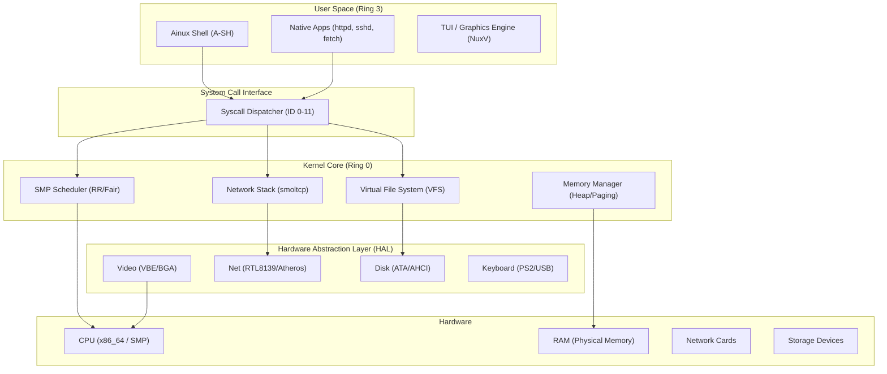
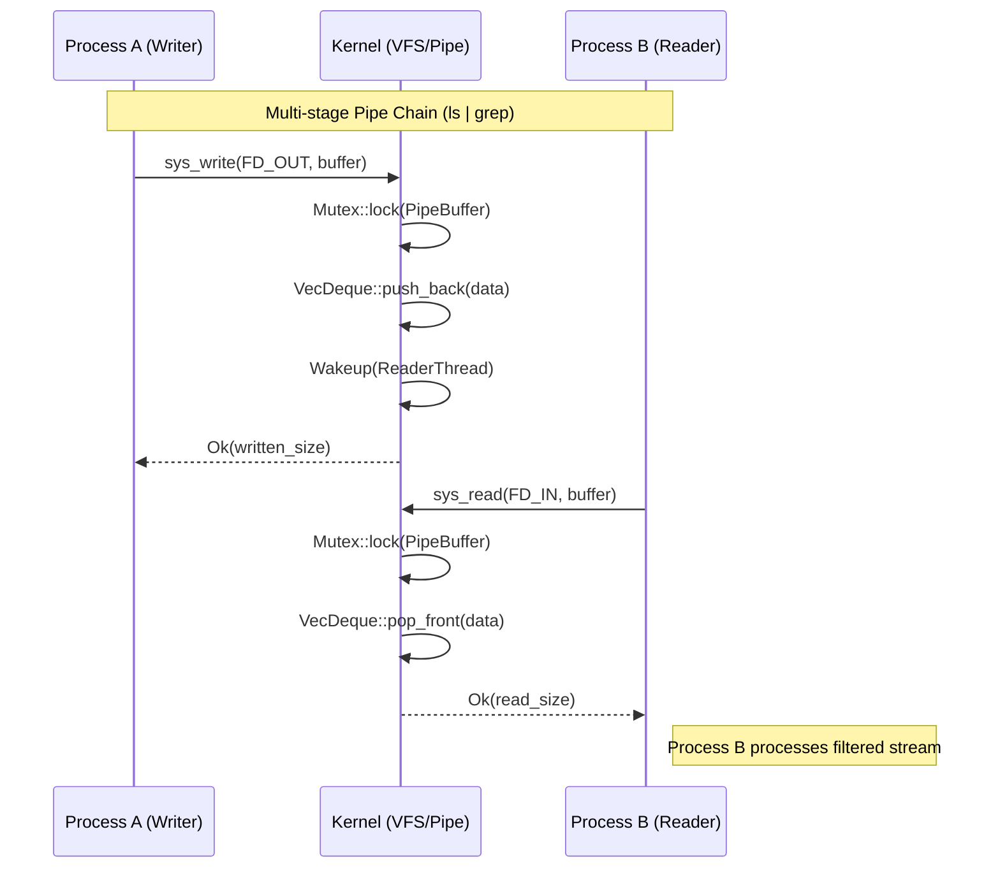
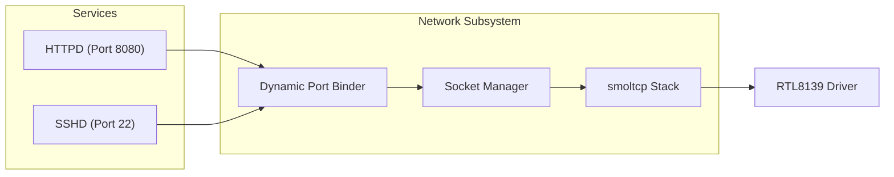

# Ainux Kernel: Industrial Architectural Blueprint

This document provides a multi-dimensional view of the Ainux Kernel's design, capturing the essence of its sovereign and industrialized architecture.

## 1. Overall System Architecture
The big picture: How Ainux sits between the hardware and the user.

---

## 2. Functional Architecture: The IPC & Pipe Flow
Detailed view of how data moves through the new Pipe infrastructure.

---

## 3. Network Feature Architecture
Dynamic port binding and service hosting.

---

## 4. Feature Matrix (Capability View)

| Category | Feature | Status | Implementation Detail |
| :--- | :--- | :--- | :--- |
| **Core** | SMP Support | ✅ Active | Multiprocessor bootstrap (AP Trampoline) |
| **Core** | Paging | ✅ Active | 4-level paging (ML4T) |
| **Filesystem** | VFS | ✅ Active | Unified inode/handle abstraction |
| **Filesystem** | Ext4 | ✅ Active | Read/Write support via debugfs injection |
| **Filesystem** | Pipes | ✅ Active | Synchronized circular buffers (`|`) |
| **Network** | TCP/IPv4 | ✅ Active | smoltcp integration |
| **Network** | Dynamic Ports | ✅ Active | Multi-service socket management |
| **UI** | Graphics | ✅ Active | VBE/BGA high-res support |
| **Security** | Signals | 🚧 Planned | `sys_kill`, `SIGINT` handling |
| **Advanced** | ASOA | 🚧 Planned | Sovereign State Restoration (ASOA) |

---

## 5. Directory Mapping
| Module | Path | Responsibility |
| :--- | :--- | :--- |
| `Process` | `src/process/` | Scheduler, Task Switching, Threading |
| `Filesystem`| `src/fs/` | VFS, Ext4, Btrfs, Pipes |
| `Network` | `src/net/` | smoltcp wrappers, Socket handles |
| `CPU` | `src/cpu/` | GDT, IDT, Syscalls, Interrupts |
| `Drivers` | `src/drivers/` | Hardware interaction (Video, Net, ATA) |
| `Apps` | `src/apps/` | Native kernel-mode binaries (httpd, sshd) |
